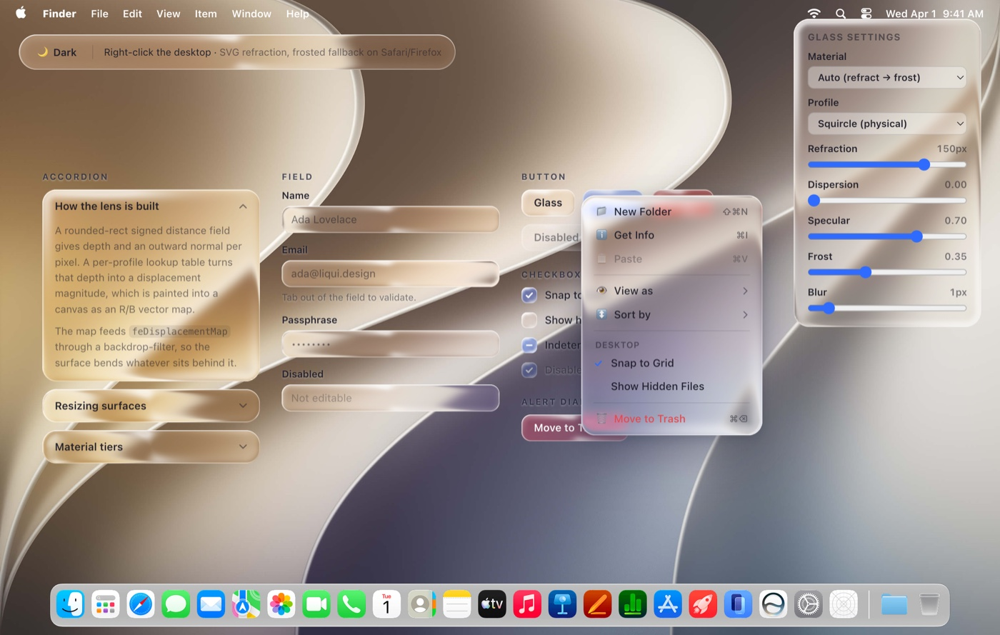

<div align="center">

# liqui

**Liquid glass components for React, built on [Base UI](https://base-ui.com).**

Surfaces that actually refract what is behind them — a canvas-generated displacement
map driving an SVG filter, not a blur with a white overlay.

[Documentation](https://liqui.design) · [Glass handbook](https://liqui.design/docs/handbook/glass) · [Components](https://liqui.design/docs/components/button)

[](https://www.npmjs.com/package/@liqui-design/glass)
[](./LICENSE)



<sub>Every surface above is refracting the wallpaper behind it — look at where the curves cross an edge. Run it yourself with <code>pnpm dev:playground</code>.</sub>

</div>

---

## How it ships

Components are **source code in your project**, installed with the shadcn CLI. You own
the file, you edit the file. Only the refraction kernel — the displacement-map maths,
the document-wide SVG filter registry, and the browser fallbacks — stays a dependency,
because those are the parts you cannot reasonably maintain by hand.

```bash
npx shadcn@latest add https://liqui.design/r/button.json
```

Installing more than one? Register the namespace once in your `components.json`
and drop the URLs:

```json
{
  "registries": {
    "@liqui-design": "https://liqui.design/r/{name}.json"
  }
}
```

```bash
npx shadcn@latest add @liqui-design/button
```

> `@liqui-design/button` is a registry item, not an npm package — the namespace
> is a key in your own `components.json` and resolves through the shadcn CLI.
> The only thing that comes from npm is
> [`@liqui-design/glass`](https://www.npmjs.com/package/@liqui-design/glass),
> which the CLI installs for you.

liqui is built on the same Base UI base as shadcn/ui (`shadcn init -b base`), so an
existing `components.json`, `cn()` and Tailwind token setup carries over unchanged.

## Use it

```tsx
import { Button } from '@/components/ui/button';

export default function Page() {
  return (
    <main className="min-h-dvh bg-[url(/wallpaper.jpg)] bg-cover p-10">
      <Button variant="accent">Continue</Button>
    </main>
  );
}
```

Note the background. **Glass refracts what is behind it**, so a surface on a flat fill
has nothing to show and will look like a slightly grey box. Put it over imagery, video,
a gradient with real edges, or content that scrolls underneath.

## Components

| | |
| --- | --- |
| [Accordion](https://liqui.design/docs/components/accordion) | Each item is its own surface, resizing with its panel |
| [Alert Dialog](https://liqui.design/docs/components/alert-dialog) | The only surface that refracts a dimmed scrim |
| [Button](https://liqui.design/docs/components/button) | Glass, accent and danger tints |
| [Checkbox](https://liqui.design/docs/components/checkbox) | Fills with accent while keeping the bezel and rim light |
| [Context Menu](https://liqui.design/docs/components/context-menu) | Submenus, checkbox and radio items, keep-mounted popup |
| [Field](https://liqui.design/docs/components/field) | Focus and invalid rings on the surface, not the input |

## Browser support

| | Refraction | Notes |
| --- | :---: | --- |
| Chromium | ✅ | Full displacement refraction |
| Safari | — | Drops `backdrop-filter` entirely when it references an SVG filter. WebKit bug [245510](https://bugs.webkit.org/show_bug.cgi?id=245510) has an implementation in review |
| Firefox | — | Same |

The fallback to frosted blur is automatic and needs no configuration, but it is worth
looking at: a design tuned to `frost: 0` can be unreadable once the lens is gone,
because in the refraction tier the lens was doing work the tint would otherwise have to
do. See the [glass handbook](https://liqui.design/docs/handbook/glass#degradation).

## Requirements

- React 18 or 19
- Tailwind CSS v4

## Repository

```
packages/glass    @liqui-design/glass — the refraction kernel
apps/www          documentation site, and the registry the CLI installs from
apps/playground   Vite app for tuning the optics against a real backdrop
```

See [CONTRIBUTING.md](./CONTRIBUTING.md) to run it locally or add a component.

## License

[MIT](./LICENSE)
