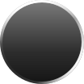

<div align="center">



# Liqui Design

**基于 [Base UI](https://base-ui.com) 的 React 液态玻璃组件库。**

表面会真的折射背后的内容，用 canvas 生成置换贴图配合 SVG 滤镜实现，
而不是一层模糊加一块白色蒙版。

[English](./README.md) · 简体中文

[文档](https://liqui.design) · [玻璃手册](https://liqui.design/docs/handbook/glass) · [组件](https://liqui.design/docs/components/button) · [图库](https://liquidglassdesign.com/?ref=liqui.design)

[](https://www.npmjs.com/package/@liqui-design/glass)
[](./LICENSE)

</div>

---

> 站点文档目前只有英文版，本文中的链接都会跳转到英文页面。

## 安装

```bash
npx shadcn@latest add https://liqui.design/r/button.json
```

这条命令会把 `components/ui/button.tsx` 写进你的项目，把玻璃设计令牌加到
`globals.css`，并安装 `@liqui-design/glass` 包。

如果要装多个组件，可以在 `components.json` 里注册一次命名空间：

```json
{
  "registries": {
    "@liqui-design": "https://liqui.design/r/{name}.json"
  }
}
```

```bash
npx shadcn@latest add @liqui-design/button
```

> `@liqui-design/button` 是 registry 条目，不是 npm 包。这个命名空间是你自己
> `components.json` 里的一个键，由 shadcn CLI 负责解析。真正发布到 npm 的只有
> [`@liqui-design/glass`](https://www.npmjs.com/package/@liqui-design/glass)，
> CLI 会自动帮你装上。

### 环境要求

- React 18 或 19
- Tailwind CSS v4

liqui 和 shadcn/ui 用的是同一套 Base UI 基础（`shadcn init -b base`），所以你已有的
`components.json`、`cn()` 和 Tailwind 令牌配置都能直接沿用。

## 用法

```tsx
import { Button } from '@/components/ui/button';

export default function Page() {
  return (
    <main className="min-h-dvh bg-[url(/wallpaper.jpg)] bg-cover p-10">
      <Button variant="accent">Continue</Button>
    </main>
  );
}
```

注意那个背景。玻璃折射的是它背后的东西，放在纯色填充上就没有可折射的内容，看起来只会是
一个略微发灰的方块。把组件放到图片、视频、有明显边界的渐变，或者会从下方滚过的内容上面。

## 你装到的是什么

组件是以源码形式进到你项目里的，文件归你所有，跟你自己写的组件一样随便改。

例外是折射内核。置换贴图的计算、全文档范围的 SVG 滤镜注册表和浏览器兜底方案都留在
`@liqui-design/glass` 包里，这部分不适合手工维护。

## 组件

| | |
| --- | --- |
| [Accordion](https://liqui.design/docs/components/accordion) | 每一项都是独立的表面，随面板一起改变尺寸 |
| [Alert Dialog](https://liqui.design/docs/components/alert-dialog) | 模态且不可随手关闭，折射一层压暗的遮罩 |
| [Button](https://liqui.design/docs/components/button) | 提供玻璃、强调色和危险色三种着色 |
| [Checkbox](https://liqui.design/docs/components/checkbox) | 以强调色填充，同时保留斜面和高光边缘 |
| [Context Menu](https://liqui.design/docs/components/context-menu) | 支持子菜单、复选与单选项，弹层可保持挂载 |
| [Dialog](https://liqui.design/docs/components/dialog) | 可关闭的那一个，角上的关闭按钮保持扁平 |
| [Field](https://liqui.design/docs/components/field) | 聚焦环和错误环画在表面上，而不是 input 上 |
| [Menu](https://liqui.design/docs/components/menu) | 下拉菜单，与作为触发器的玻璃按钮保持不重叠 |
| [Menubar](https://liqui.design/docs/components/menubar) | 一条玻璃承载多个菜单，触发器在其中扁平化 |
| [Number Field](https://liqui.design/docs/components/number-field) | 一块玻璃一个镜面，加减按钮只是它的分区 |
| [Popover](https://liqui.design/docs/components/popover) | 带指示尾巴的玻璃面板，内部承载扁平化的控件 |
| [Progress](https://liqui.design/docs/components/progress) | 轨道是透镜，填充只是覆在其上的一层色晕 |
| [Radio Group](https://liqui.design/docs/components/radio-group) | 它是一份列表而非一条整块，所以每个选项各自成镜 |
| [Select](https://liqui.design/docs/components/select) | 玻璃触发器配玻璃弹层，并避免两者重叠 |
| [Slider](https://liqui.design/docs/components/slider) | 滑块是那枚透镜，轨道刻意保持扁平 |
| [Switch](https://liqui.design/docs/components/switch) | 轨道是透镜，滑块刻意保持不透明 |
| [Tabs](https://liqui.design/docs/components/tabs) | 指示器才是透镜，在扁平的凹槽里滑动 |
| [Toggle](https://liqui.design/docs/components/toggle) | 会保持按下状态的按钮，打开时玻璃被染成强调色 |
| [Toggle Group](https://liqui.design/docs/components/toggle-group) | 一条玻璃，一枚透镜，里面的按钮全部扁平化 |
| [Tooltip](https://liqui.design/docs/components/tooltip) | 最小的表面，磨砂更重以保证可读性 |

## 浏览器支持

| | 折射 | 说明 |
| --- | :---: | --- |
| Chromium | ✅ | 完整的置换折射 |
| Safari | — | 只要 `backdrop-filter` 引用了 SVG 滤镜就会被整个丢弃。WebKit bug [245510](https://bugs.webkit.org/show_bug.cgi?id=245510) 的实现正在评审中 |
| Firefox | — | 同上 |

降级到磨砂模糊是自动的，不需要任何配置，但还是要亲自看一眼效果。按 `frost: 0` 调好的
设计在透镜消失后可能变得难以阅读，因为原本由透镜承担的工作会全部落到着色上。
[玻璃手册](https://liqui.design/docs/handbook/glass#degradation)里有详细说明。

## 项目由来

liqui 源自 [Liquid Glass Design](https://liquidglassdesign.com/?ref=liqui.design)，
一个收录液态玻璃与毛玻璃设计参考的策展图库，两者至今是各自独立的站点。图库收集这种视觉
风格，而这里是你可以直接装进项目的那部分。

## 仓库结构

```
packages/glass    @liqui-design/glass，折射内核
apps/www          文档站点，以及 CLI 安装时读取的 registry
apps/playground   Vite 应用，用于对着真实背景调试光学参数
```

本地运行或新增组件，见 [CONTRIBUTING.md](./CONTRIBUTING.md)。

## 许可

[MIT](./LICENSE)
